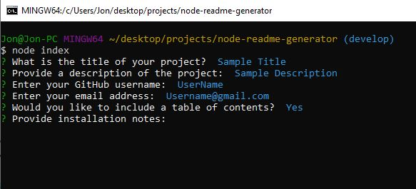

# Professional README Generator

## Description

This is a Node.js application that uses command line input to help build a pre-formatted and professional looking README.md file for their particular project. 

## Table of Contents

- [Description](#description)
- [Installation](#installation)
- [Usage](#usage)
- [License](#license)
- [Contributing](#contributing)
- [Questions](#questions)

## Installation

- Download or clone the project files to your local system
- Download and install Node.js if you don't have it already
- Open a terminal window
- Navigate to the directory in which you placed the project files
- Type the command 'npm install' to install all project dependencies

## Usage

- Follow instructions from the installation section
- Open a terminal window
- Navigate to the directory you saved your project files in
- Type the command 'node index' to initialize and run the application
- Some of the prompts are required so you will be re-prompted if needed
- Once you answer all of the prompts, a README.md file will be outputted in the same directory as your project files. 

### Screenshot:

### Video Walkthrough:

https://user-images.githubusercontent.com/95663736/155817694-e4a2d0c7-fca0-45c5-98e6-16321ab64302.mp4

## License

This project is covered under the [GNU General Public License v3.0](https://www.gnu.org/licenses/)

## Contributing

If you wish to contribute to this project, follow these steps:

- Fork the repository
- Clone or download to your local
- Make any changes/updates and push to your remote fork
- Start a pull request

## Questions

View my [GitHub Page](https://github.com/JonMooney)

Send me an email @ [jon.mooney@yahoo.com](mailto:jon.mooney@yahoo.com)
